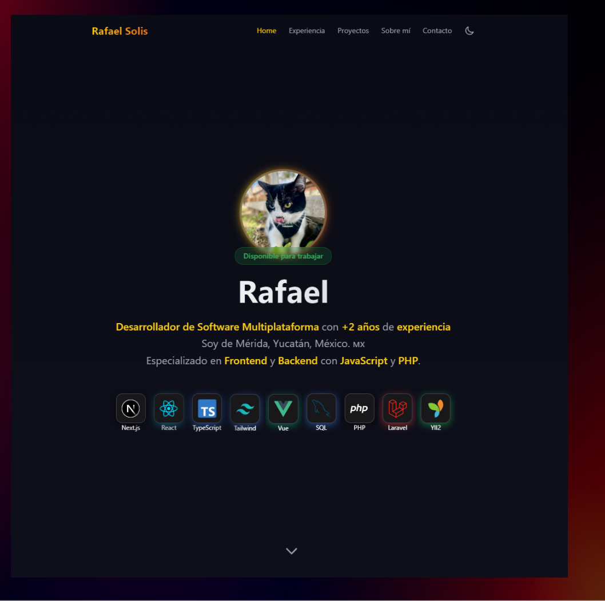

# 📱 Rafaelx-ss Portfolio

Welcome to **Rafaelx-ss Portfolio**, a professional and elegant showcase of my skills, projects, and experience. Built with the latest technologies, this portfolio is designed to deliver an optimized and seamless user experience. Developed using **Nuxt 3** and **Vue**, and deployed on **Vercel** for lightning-fast performance.

---

<!-- Badges -->
[![Last Commit][last-commit-shield]][last-commit-url]
[![License][license-shield]][license-url]
[![Deployment][deployment-shield]][deployment-url]
[![Framework][framework-shield]][framework-url]
[![TailwindCSS][tailwindcss-shield]][tailwindcss-url]
[![Contributors][contributors-shield]][contributors-url]
[![Last Commit][last-commit-shield]][last-commit-url]
[![GitHub followers][gitHubfollowers-shield]][gitHubfollowers-url]


---

## 🚀 Live Demo

Explore the live version of the portfolio here:
**[Rafaelx-ss Portfolio](https://portafolio-rafaelx.vercel.app/)**



---

## 🛠️ Technologies Used

This project leverages a combination of modern technologies to ensure a polished and high-performance portfolio:

- **Nuxt 3**: For a dynamic and highly optimized web application.
- **Vue**: The powerful front-end framework.
- **TailwindCSS**: Ensures a clean and responsive design.
- **Vercel**: For seamless deployment and hosting.
- **TypeScript**: Static typing for maintainable and error-free code.
- **JavaScript**: Core programming for interactivity.

---

## 🔧 Setup & Installation

Follow these steps to clone and run the project locally:

1. Clone the repository:
    ```bash
    git clone https://github.com/Rafaelx-ss/portafolio.git
    ```

2. Navigate to the project folder:
    ```bash
    cd portafolio
    ```

3. Install the dependencies:
    ```bash
    npm install
    ```

4. Start the development server:
    ```bash
    npm run dev
    ```

5. Open your browser and navigate to `http://localhost:3000` to view the project.

---

## 📂 Project Structure

- **`components`**: Reusable Vue components.
- **`layouts`**: Defines page layouts.
- **`pages`**: All the web pages of the portfolio.
- **`assets`**: Static resources like images and styles.
- **`plugins`**: Custom plugins for added functionality.
- **`nuxt.config.ts`**: Configuration file for Nuxt.

---

## 🎨 Styling & Design

The portfolio features a clean and responsive design powered by **TailwindCSS**. Custom styles include:

- **Hero Section**: Showcases an introduction with animated elements.
- **Skills Section**: Highlights technical skills with icons and progress bars.
- **Projects Section**: A grid layout to display completed projects with hover effects.
- **Contact Section**: Includes a form for inquiries and social media links.

---

## 📊 Skills Highlight

### Frontend Development:
- **React** | **Next** | **Vue** | **Nuxt** | **Astro**
- **TypeScript** | **JavaScript**
- **TailwindCSS** | **Bootstrap**

### Backend Development:
- **Laravel** | **Yii2**
- **PHP**
- **MySQL** | **PostgreSQL**

### Mobile Development:
- **React Native** | **Expo**

---

## 👤 About Me

Hi! I'm **Rafaelx-ss**, a passionate developer with expertise in creating responsive web and mobile applications. My focus is on delivering solutions that are both innovative and user-friendly.

---

## 📜 License

This project is licensed under the **MIT License**. See the [LICENSE](./LICENSE) file for details.

---

## 💼 Author

- **GitHub**: [Rafaelx-ss](https://github.com/Rafaelx-ss)

---

## 🛠 Useful Scripts

- **Build for Production**:
    ```bash
    npm run build
    ```

- **Generate Static Files**:
    ```bash
    npm run generate
    ```

- **Start Development Server**:
    ```bash
    npm run dev
    ```

---

## 🌐 Deployment

This portfolio is deployed using **Vercel** for optimal performance. To deploy, follow these steps:

1. Install the Vercel CLI:
    ```bash
    npm install -g vercel
    ```

2. Deploy the project:
    ```bash
    vercel
    ```

---

[contributors-shield]: https://img.shields.io/github/contributors/Rafaelx-ss/portafolio?color=blueviolet&style=for-the-badge&logo=github
[contributors-url]: https://github.com/Rafaelx-ss/portafolio/graphs/contributors

[last-commit-shield]: https://img.shields.io/github/last-commit/Rafaelx-ss/portafolio?color=green&style=for-the-badge&logo=git
[last-commit-url]: https://github.com/Rafaelx-ss/portafolio

[license-shield]: https://img.shields.io/badge/license-MIT-orange.svg?style=for-the-badge&logo=open-source-initiative
[license-url]: https://github.com/Rafaelx-ss/portafolio/blob/main/LICENSE

[deployment-shield]: https://img.shields.io/badge/Deployed%20on-Vercel-black?style=for-the-badge&logo=vercel
[deployment-url]: https://portafolio-rafaelx.vercel.app/

[framework-shield]: https://img.shields.io/badge/Framework-Nuxt%203-00C58E?style=for-the-badge&logo=nuxt.js
[framework-url]: https://nuxt.com/

[tailwindcss-shield]: https://img.shields.io/badge/Styling-TailwindCSS-38B2AC?style=for-the-badge&logo=tailwind-css
[tailwindcss-url]: https://tailwindcss.com/

[gitHubfollowers-shield]: https://img.shields.io/github/followers/Rafaelx-ss?style=for-the-badge
[gitHubfollowers-url]: https://github.com/Rafaelx-ss

